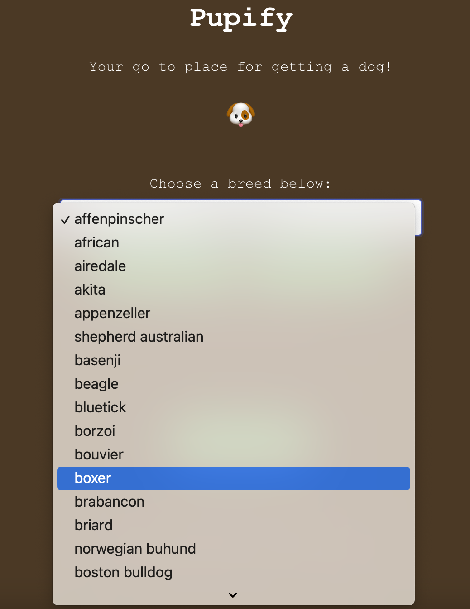
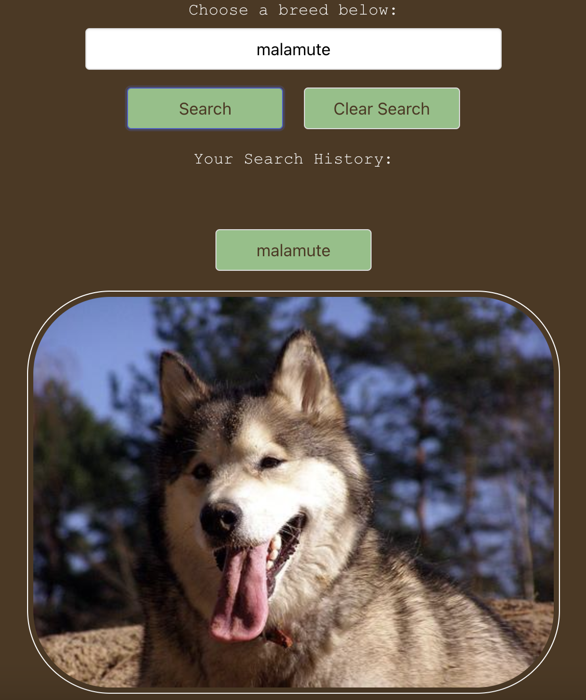
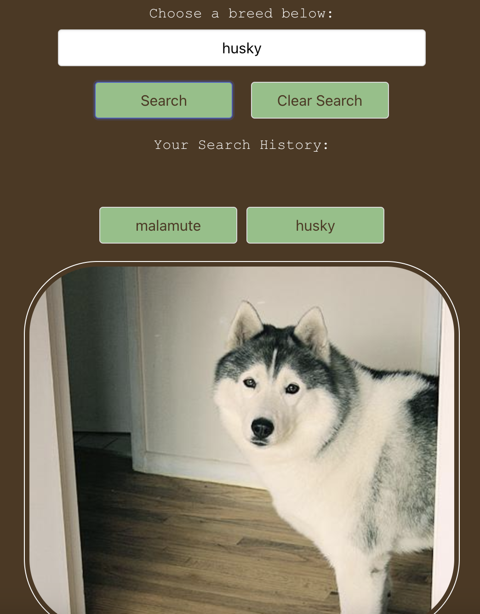
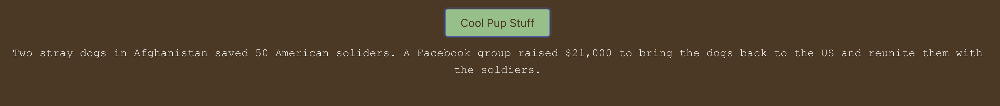
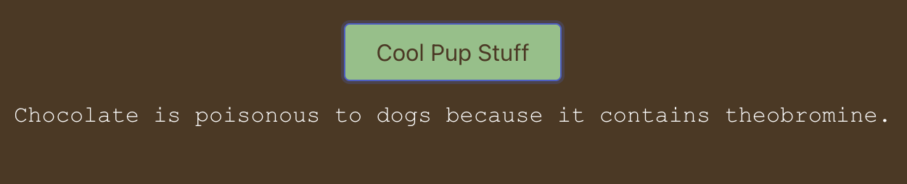

# Pupify :dog:

## Description :page_facing_up:

The purpose of this repository is to help people who are thinking about getting a dog see what a particular breed looks like and learn some facts about dogs.

### User Story
- AS A person who is interested in getting a dog
- I WANT to see what a particular breed looks like and know some information about dogs
- SO THAT I can decide if I should to get a dog or not

## Usage :wrench:

- [Click here](https://mattoz.github.io/Pupify/) to navigate to the live link of this repository.
- You will also need to [click here](https://cors-anywhere.herokuapp.com/corsdemo) to request access to the demo server for the Dog fact API to show up. (You will also need to keep requesting it if Dog Fact is not showing since it only allows for a temporary access for a period of time).

-------------------------------------------------------------

- You will be presented with an interactive webpage:

-------------------------------------------------------------

- Click the dropdown menu to select a bread, then click search for an image of the breed you selected to show:

-------------------------------------------------------------

- If you search multiple breeds, you will have your selections stored in your searh history that you click on and display that breed again:

-------------------------------------------------------------

- If you click on "Cool Pup Stuff" it will display a dog fact, you can click as many times you would like to dosplay different fact:

-------------------------------------------------------------

## Features :confetti_ball:
- 2 Server-Side APIs
- CSS Framework
- Responsive Webpage
- Interactive Webpage
- Client-Side Storage
- Dropdown Search Menu
- Image Display
- Fact Display
- Styled Cursor
- Use of Emojis
- Use of Color Palettes

## Technologies Used :sparkles:

### APIs
- [Dog Pics](https://dog.ceo/dog-api)
- [Dog Facts](https://kinduff.github.io/dog-api/)
- [Request Access to proxy server](https://cors-anywhere.herokuapp.com/)

### Framework
- [Bulma](https://bulma.io/)

### Color Palette
- [Coolors](https://coolors.co/e3d26f-ca895f-a15e49-4e3822-2f1b25)

### Applications
- VS Code

## Successes :star2:
- Functional deployed website that is interactive and responsive.
- Both APIs are connected successfully.
- CSS Framework is connected successfully.

## Challenges :tornado:
- Image API inconsistent display from their server.
- Need to request temporary access to demo server for the Dog Facts API.

## Future Development :bulb:
- If time is not a factor, we could match dog fact with the dog breed.

## Credit :medal_military:

- Bootcamp Materials.
- Bootcamp Class Video Recordings.
- Bootcamp Instructor and TA.

Thank you for visiting! :hibiscus:
